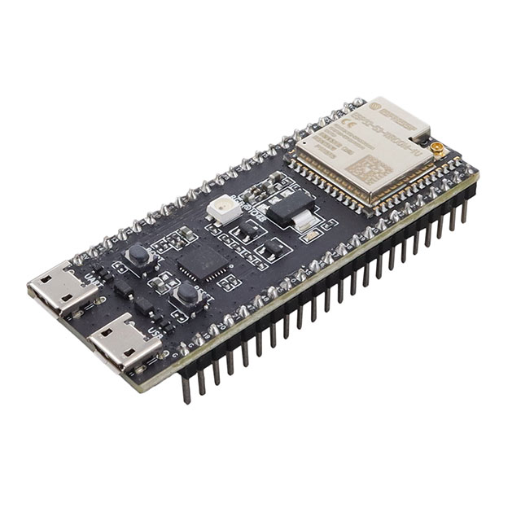

# prop-teststand

This project contains all the control code for the QRET propulsion sub team's static hot fire setup.

## IDE Setup

This project is intended to be opened in VSCode. When you first open the project, install the recommended extensions that pop up in the bottom right.

## Environment Setup

To run this project you should be running Python3.11.x, with an isolated virtual environment. See [python docs](https://docs.python.org/3/library/venv.html) for help setting up a virtual environment.

To install all the required packages to work as a developer on this code, run: ```pip install -e .``` in the ./prop-teststand directory. This installs the listed requirements in the pyproject.toml file.

## ESP32 Setup

### Our Hardware Specifications

The boards that have been currently purchased for the PROP stand are ESP32-S3 boards with the N16R8 chip on them. They are technically listed as ESP32-S3-DevKitC1s (a dev kit made by Espressif), but we bought cheap clones of these off of amazon. The link we bought them from is [here](https://www.amazon.ca/SANXIXING-Development-Module-Internet-ESP32-S3-DevKitC-1/dp/B0D9W4Y3F3?crid=RNR0KQUWLIRY&dib=eyJ2IjoiMSJ9.L3N0fctYqS3MoEGZwm_e5-yvLgmx9oru7I8WMspaK0n0p2E1U9Af3EI9D8wmpKylLkwaMf0RfzgCFrfuAPfCkakd8BhziLWNae4wJ58cff2QtFSa2hJhyVbh8ZXHLvMcZ0YQJ_KLo2G8Eu_aKBSFRA71hgue_ahoAOW6QdFHVM1G-G6kDE3dRi1jDScdHnm6Jfri_LmO90oBHaFGrnG158DEhYZ71GR3_e49bWbM0UK_pBE5eG2-45Z-AEnn04hdQLloIcG877aqJE-xmycsbe2CIZtyAaYzJghXrvTMgz0.FpW2y_2goffZthFJOV6yF2RooqFmVjpo9pGW7LPxPGc&dib_tag=se&keywords=esp32s3&qid=1732301035&sprefix=esp32%2Caps%2C105&sr=8-5>). The N16R8 chip has 16MB of flash and 8MB of Pseudo Static RAM (PSRAM) with the ram configured as Octal SPI RAM (OSRAM) allowing higher data transfer rates then other SPI formats (QSPI, or SPI).

{ width=400}

### Installing Micropython

The current plan for this project is to have it operate in Micropython. This may change as we test out our final installation but this is the quickest way to get the code running right now.
**The steps are as follows:**

1. Download the generic ESP32S3 Octal SPIRAM binary file (.bin) from the [official micropython site](https://micropython.org/download/ESP32_GENERIC_S3/) for the ESP32. As of writing this, the most recent version is ESP32_GENERIC_S3-SPIRAM_OCT-20241025-v1.24.0.bin
2. This generic build only has flash size configured for 8MB. Since we are using a chip with 16MB flash, we need to update the build. To do this, use the **mp-image-tool-esp32** library (install with: ```pip install mp-image-tool-esp32```) and run the following command:
```mp-image-tool-esp32 .\ESP32_GENERIC_S3-SPIRAM_OCT-20241025-v1.24.0.bin -f 16M --resize vfs=0```
This will re-configure the micropython build to accept 16MB of flash and resize vfs to account for our chip
3. Install the **esptool** python library (```pip install esptool```) to be able to flash firmware to the ESP32.
4. Plug in your ESP32 and put the board into boot mode by pressing and holding the boot button (button closest to USBC ports) and pressing the reset button (button closest to heat spreader) once.
5. Check the port the device connected to. It will appear as a USB serial device. Run the command  "```esptool --port COMXX erase_flash```", where COMXX is something like COM3, to clear out whatever is currently in flash.
6. Run the command "```esptool --chip esp32s3 --port COMXX write_flash -z 0 . FILEPATH.bin```" where COMXX is the COM port the device is connected to and FILEPATH is the path to the micropython image with the updated flash memory. The ```-z``` option tells the command to not try and detect the flash chip as we've already specified the size and the ```0``` parameter tells the script to start writing at the 0x0000 memory address (as specified in [the official ESP32s3 micropython setup documentation](https://micropython.org/download/ESP32_GENERIC_S3/))
7. **IMPORTANT:** Press the reset button on the board (button closest to the big metal heat spreader on our boards) to pull the board out of boot mode and into its normal operational mode. When you do this, the COM port the device is assigned to will most likely change (e.g. COM3 for the memory flashing and COM4 in normal operation).

#### Checking install correctly

1. In the REPL for the ESP32 run ```import esp``` then ```esp.flash_size()```. You should see something around 16777216 as the return value. This means you installed the correct 16MB flash image.

### Working with micropython

The best tool to work with micropython that I've found is ```mpremote```. This library is one of the developer requirements for this project and should be installed correctly if you followed through the environment setup above.

Some useful micropython commands:

| Command | Description |
| ------- | ----------- |
| ```mpremote``` | Connects to first available serial device and opens REPL by default. Equivalent to "mpremote |
| ```mpremote connect port:COMXX``` | Connects to serial device on specified com port. Shorthand is "mpremote cXX |
| ```mpremote run <file.py>``` | Runs a script from **your computer's filesystem**. Prints any output to outside terminal. |
| ```mpremote fs``` | Prefix to give access to filesystem management commands |
| ```mpremote fs ls``` | Lists files currently in the root directory of the microcontroller |
| ```mpremote fs cp <localFile> :``` | Copies local file into the root directory of the microcontroller |

The full documentation on using mpremote can be found [here](https://docs.micropython.org/en/latest/reference/mpremote.html)